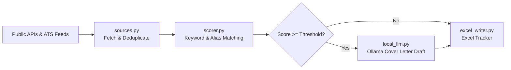

# 🤖 Job Search Agent (Semi-Automated, Local AI)

> An automated, privacy-first job discovery tool that scrapes public job boards, scores postings against your exact technical profile, and drafts custom cover letters using a **100% local LLM** (via [Ollama](https://ollama.com)).
>
> **No cloud AI bills, zero API lock-in, and no personal data leaves your machine.**

---

## 📑 Table of Contents
- [Why This Exists](#-why-this-exists)
- [How It Works](#-how-it-works)
- [Prerequisites](#-prerequisites)
- [Installation & Setup](#-installation--setup)
- [Step-by-Step: How to Create & Configure `config.yaml`](#-step-by-step-how-to-create--configure-configyaml)
- [Setting Up the Local LLM (Ollama)](#-setting-up-the-local-llm-ollama)
- [Running the Agent](#-running-the-agent)
- [Understanding the Output](#-understanding-the-output)
- [Troubleshooting & FAQs](#-troubleshooting--faqs)

---

## 💡 Why This Exists

### 1. Why No Direct Auto-Apply on LinkedIn / Naukri / Indeed?
None of these platforms provide public, authorized APIs for automatic job applications. Bots that click through browser interfaces directly violate their **Terms of Service (ToS)**, which can lead to permanent account bans or stealth shadow-banning. 

Instead, this agent talks exclusively to **official public APIs** and open developer endpoints:
- **[Adzuna API](https://developer.adzuna.com/)**: Major job aggregator with extensive India and global coverage (free key).
- **[Arbeitnow](https://www.arbeitnow.com/api/job-board-api)**: Free public API for European and remote tech roles.
- **[RemoteOK](https://remoteok.com/api)**: Free public API for global remote engineering roles.
- **Greenhouse & Lever**: Direct, public ATS endpoints for specific companies you wish to track.

### 2. Why a Local LLM Instead of Cloud APIs?
Cover letters are drafted using **Ollama** running locally on your hardware:
- **100% Private**: Your resume, contact details, and employer data are never uploaded to OpenAI, Anthropic, or external servers.
- **$0 Cost**: No subscription fees or pay-per-token API limits.
- **Graceful Degradation**: If Ollama isn't running or you don't have enough RAM/VRAM, the agent simply skips the cover letter step and still generates your full scored job spreadsheet.

---

## ⚙️ How It Works



1. **Ingestion**: Queries multiple job sources across your configured titles and locations.
2. **Deduplication**: Filters out duplicate postings across platforms.
3. **Scoring**: Calculates a match score (0–100%) based on weighted core skills, title bonuses, and flags any gap skills.
4. **Local Drafting**: Passes high-scoring matches ($\ge$ threshold) to your local Ollama model to generate personalized cover letters in `drafts/`.
5. **Report Export**: Writes color-coded, sorted results into `job_agent_results.xlsx`.

---

## 📋 Prerequisites

- **Python**: Version 3.10 or higher.
- **Git**: For version control.
- **Ollama** *(Optional, required only for cover letter generation)*: Download from [ollama.com](https://ollama.com).
- **Adzuna API Key** *(Optional, recommended for India search)*: Free sign-up at [developer.adzuna.com](https://developer.adzuna.com/).

---

## 🚀 Installation & Setup

### 1. Clone the Repository
```bash
git clone https://github.com/Sushant0999/job_scraper.git
cd job_scraper
```

### 2. Set Up a Virtual Environment

**On Windows (PowerShell):**
```powershell
python -m venv venv
.\venv\Scripts\Activate.ps1
```

**On macOS / Linux:**
```bash
python3 -m venv venv
source venv/bin/activate
```

### 3. Install Dependencies
```bash
pip install -r requirements.txt
```

### 4. Create Your `.env` File
Copy `.env.example` to create your local `.env`:

**Windows (PowerShell):**
```powershell
Copy-Item .env.example .env
```

**macOS / Linux:**
```bash
cp .env.example .env
```

Open `.env` and fill in your keys:
```ini
# Free keys from https://developer.adzuna.com/
ADZUNA_APP_ID=your_app_id_here
ADZUNA_APP_KEY=your_app_key_here

# Optional Ollama settings (defaults to http://localhost:11434 and llama3.2:3b)
OLLAMA_HOST=http://localhost:11434
OLLAMA_MODEL=llama3.2:3b
```
*(Note: If you leave Adzuna blank, the agent still runs and pulls from Arbeitnow and RemoteOK!)*

---

## 🛠️ Step-by-Step: How to Create & Configure `config.yaml`

The `config.yaml` file defines your profile, desired roles, scoring criteria, and target companies. 

If creating it from scratch or customizing it for your own stack, follow the breakdown below or copy the complete template.

### Section 1: `profile`
Defines who you are, your experience level, and your technical competencies.

```yaml
profile:
  name: "Your Name"
  email: "your.email@example.com"
  phone: "+91 9876543210"
  linkedin: "https://linkedin.com/in/yourprofile"
  github: "https://github.com/yourhandle"
  years_experience: 3.5

  # Core technical skills you actively use.
  # weight: 1 (nice to have), 2 (standard requirement), 3 (primary / non-negotiable)
  core_skills:
    - { term: "Java", weight: 3 }
    - { term: "Spring Boot", weight: 3 }
    - { term: "Microservices", weight: 3 }
    - { term: "REST API", weight: 2 }
    - { term: "MySQL", weight: 2 }
    - { term: "Docker", weight: 2 }
    - { term: "CI/CD", weight: 1 }

  # Skills you do NOT have or are currently learning.
  # The agent flags these in the Excel sheet so you know which jobs are a stretch.
  gap_skills:
    - "AWS"
    - "Kafka"
    - "Kubernetes"
    - "System Design"
```

> 💡 **Tip on Skill Aliases**: The scoring engine in `src/scorer.py` automatically normalizes common synonyms (e.g. `Spring Boot` also matches `Spring`, `SpringBoot`, `Spring Framework`, and `CI/CD` matches `Continuous Integration`).

---

### Section 2: `search`
Controls what search queries are dispatched to the APIs and what score thresholds apply.

```yaml
search:
  # Job titles to query across all platforms
  titles:
    - "Java Developer"
    - "Java Backend Developer"
    - "Spring Boot Developer"
    - "Backend Engineer"

  # Target locations
  locations:
    - "Chandigarh"
    - "Mohali"
    - "India"       # Useful for PAN-India remote or hybrid roles
    - "Remote"

  # Minimum match score (0-100) to keep the job in the final Excel output
  # Jobs scoring below this are dropped to avoid noise.
  min_match_score: 40

  # Minimum score required to trigger automated cover letter drafting via Ollama
  cover_letter_threshold: 65

  # Max results to fetch per source query (keeps API calls respectful)
  max_results_per_query: 15
```

---

### Section 3: `company_boards` *(Optional)*
Query Greenhouse and Lever applicant tracking systems (ATS) directly for target companies.

```yaml
company_boards:
  # Find tokens from career page URLs:
  # e.g., https://boards.greenhouse.io/razorpay -> token is "razorpay"
  greenhouse:
    - "razorpay"
    - "postman"

  # e.g., https://jobs.lever.co/clevertap -> token is "clevertap"
  lever:
    - "clevertap"
```

---

### Section 4: `output`
Specifies where results should be saved.

```yaml
output:
  excel_file: "job_agent_results.xlsx"
  drafts_dir: "drafts"
```

---

### Complete `config.yaml` Reference Template

```yaml
profile:
  name: "Sushant Raj"
  email: "sushantraj215@gmail.com"
  phone: "+91 8969344178"
  linkedin: "https://linkedin.com/in/sushant0999"
  github: "https://github.com/sushant0999"
  years_experience: 3.5

  core_skills:
    - { term: "Java", weight: 3 }
    - { term: "Spring Boot", weight: 3 }
    - { term: "Spring Cloud", weight: 2 }
    - { term: "Microservices", weight: 3 }
    - { term: "REST API", weight: 2 }
    - { term: "MySQL", weight: 2 }
    - { term: "PostgreSQL", weight: 2 }
    - { term: "Redis", weight: 1 }
    - { term: "RabbitMQ", weight: 1 }
    - { term: "Docker", weight: 2 }
    - { term: "Jenkins", weight: 1 }
    - { term: "CI/CD", weight: 1 }
    - { term: "JUnit", weight: 1 }
    - { term: "Mockito", weight: 1 }
    - { term: "SQL", weight: 1 }
    - { term: "Agile", weight: 1 }

  gap_skills:
    - "AWS"
    - "Azure"
    - "Kafka"
    - "Kubernetes"
    - "OAuth2"
    - "JWT"
    - "System Design"

search:
  titles:
    - "Java Developer"
    - "Java Backend Developer"
    - "Spring Boot Developer"
    - "Backend Engineer"
    - "Software Engineer Java"

  locations:
    - "Chandigarh"
    - "Mohali"
    - "Panchkula"
    - "India"
    - "Remote"

  min_match_score: 40
  cover_letter_threshold: 65
  max_results_per_query: 15

company_boards:
  greenhouse: []
  lever: []

output:
  excel_file: "job_agent_results.xlsx"
  drafts_dir: "drafts"
```

---

## 🦙 Setting Up the Local LLM (Ollama)

If you want the agent to automatically draft tailored cover letters for your highest-scoring roles:

1. **Install Ollama**: Visit [ollama.com](https://ollama.com) and install it for Windows, Mac, or Linux.
2. **Pull a Model**:
   ```bash
   # Recommended default (~2GB download, runs smoothly on 4GB VRAM or modern CPU)
   ollama pull llama3.2:3b
   ```
   *(For high-spec machines with 16GB+ RAM / 8GB+ VRAM, you can try `ollama pull llama3.1:8b` and update `OLLAMA_MODEL` in `.env`)*.
3. **Start Ollama**:
   ```bash
   ollama serve
   ```
   *(If Ollama is already running as a background service on your system, you can skip this command).*

---

## 🏃 Running the Agent

With your virtual environment activated and `.env` configured:

```bash
python main.py
```

### What Happens During Execution:
1. Queries Adzuna, Arbeitnow, and RemoteOK.
2. Deduplicates incoming jobs by `(company, title, url)`.
3. Scores each job against your `core_skills` and calculates title bonuses.
4. If Ollama is active, drafts custom cover letters in `drafts/` for jobs scoring $\ge$ `cover_letter_threshold`.
5. Saves formatted results to `job_agent_results.xlsx`.

---

## 📊 Understanding the Output

### 1. `job_agent_results.xlsx`
The output spreadsheet formats all results with color-coded score bands:
- 🟩 **Green ($\ge 75\%$)**: Strong match — immediate priority to review and apply.
- 🟨 **Yellow ($55\% - 74\%$)**: Decent match — good candidate, check flagged gap skills.
- 🟥 **Red ($40\% - 54\%$)**: Marginal match — review carefully.

| Column | Description |
|---|---|
| **Match Score** | Calculated percentage match against your core skills. |
| **Company & Title** | Name of hiring organization and job role. |
| **Matched Skills** | Comma-separated list of skills from your profile detected in the JD. |
| **Gap Flags** | Identified skills from your `gap_skills` list present in the JD. |
| **Application Link** | Direct URL to the posting or careers page. |
| **Cover Letter Draft** | Path to the `.txt` draft in `drafts/` (if generated). |
| **Status / Notes** | Ready-made columns for tracking your manual applications. |

### 2. Cover Letter Drafts (`drafts/`)
Top matches receive a ready-to-use, tailored cover letter saved as:
```
drafts/<Company>_<Role_Title>.txt
```
The prompt instructs the model to produce a concise, 4-paragraph letter highlighting your quantifiable achievements, mapping your skills directly to the posting, and addressing any technology gaps as active upskilling.

---

## ❓ Troubleshooting & FAQs

- **Q: `PermissionError` when running `main.py`?**  
  **A**: You likely have `job_agent_results.xlsx` open in Microsoft Excel. Close the file in Excel and run `python main.py` again.

- **Q: Ollama step is skipped?**  
  **A**: Make sure the Ollama application or service is running (`ollama serve`) and that you have pulled the model specified in `.env` (`ollama pull llama3.2:3b`).

- **Q: Adzuna returns 0 results?**  
  **A**: Verify that `ADZUNA_APP_ID` and `ADZUNA_APP_KEY` are properly defined in your `.env` file without extra quotes or spaces.

- **Q: How do I track more companies directly?**  
  **A**: Open [config.yaml](file:///c:/Users/susha/Desktop/job_agent_0.1/config.yaml) and add company tokens under `company_boards.greenhouse` or `company_boards.lever`. No Python code edits needed!

---

## 📄 License
This project is open-source and intended for personal career search automation.
